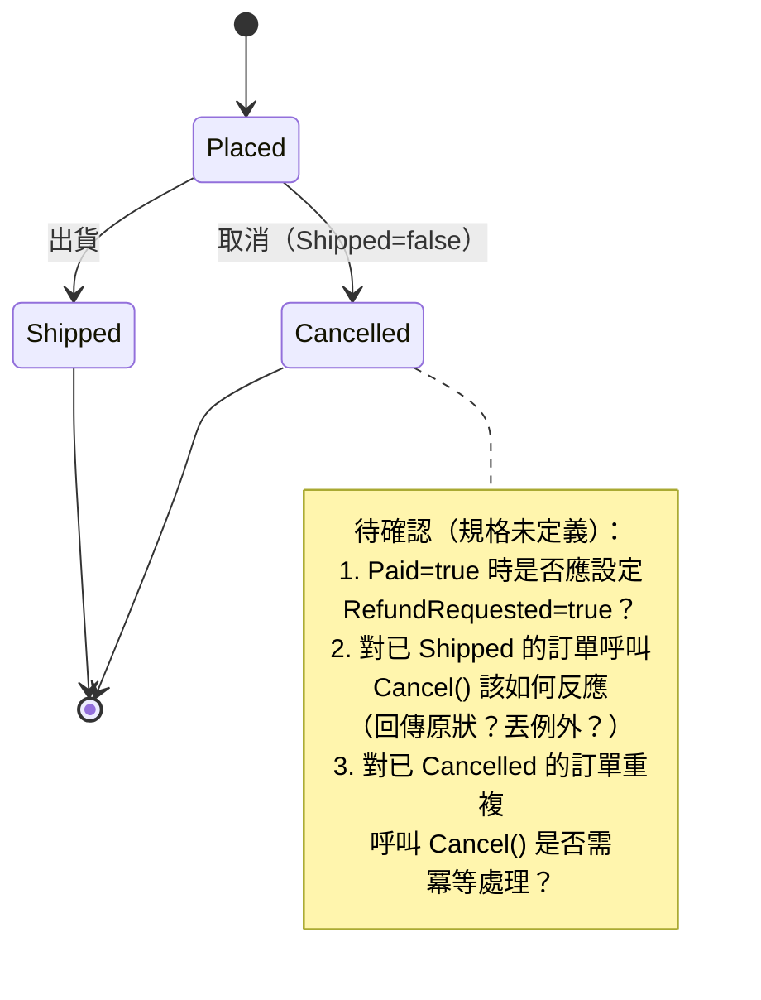

```mermaid
stateDiagram-v2
    [*] --> Placed
    Placed --> Shipped: 出貨
    Placed --> Cancelled: 取消（Shipped=false）
    Shipped --> [*]
    Cancelled --> [*]

    note right of Cancelled
        待確認（規格未定義）：
        1. Paid=true 時是否應設定
           RefundRequested=true？
        2. 對已 Shipped 的訂單呼叫
           Cancel() 該如何反應
           （回傳原狀？丟例外？）
        3. 對已 Cancelled 的訂單重複
           呼叫 Cancel() 是否需
           冪等處理？
    end note
```