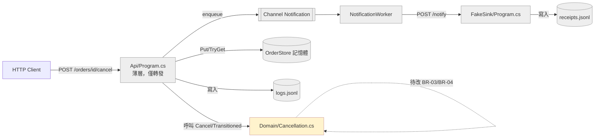
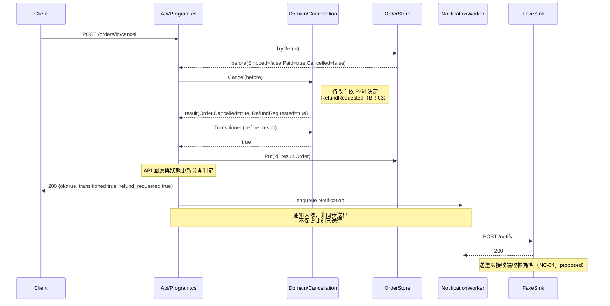
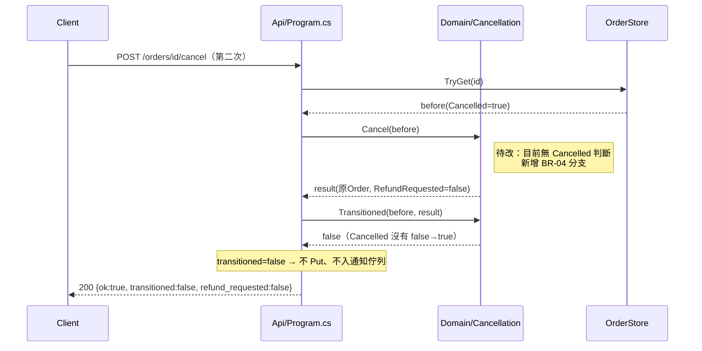

# Day10 設計審查包：BR-03／BR-04 修改範圍分析

> 範圍聲明：本文件只涵蓋 `specs/rules-v2.md` 的退款要求（BR-03）與重複取消（BR-04）之設計。通知契約（`notification-contract-v2.1.md`）仍是 `proposed`，本文件不對其做實作承諾，僅在追蹤資料流時指出「目前程式已有」的通知路徑做為既有事實。未執行 `.NET` 測試，以下所有「PASS/FAIL」皆非本輪產出。

---

## 1. 呼叫鏈與資料流追蹤（API 取消入口 → Domain → 結果使用端）

區分【呼叫】（Call，一段程式主動呼叫另一段）與【資料流】（Data，值被傳遞/序列化/寫出，不代表執行流程本身）。

### 1.1 呼叫鏈（Call）

| 步驟 | 動作 | 位置 |
|---|---|---|
| 1 | HTTP POST 進入取消端點 | `src/Api/Program.cs:48` `app.MapPost("/orders/{id}/cancel", ...)` |
| 2 | 讀取現有訂單 | `src/Api/Program.cs:63` 呼叫 `store.TryGet` → 定義於 `src/Api/Program.cs:100` |
| 3 | **呼叫 Domain 計算結果** | `src/Api/Program.cs:69` `Cancellation.Cancel(before)` → 定義於 `src/Domain/Cancellation.cs:8` |
| 4 | Domain 內：已出貨分支 | `src/Domain/Cancellation.cs:11-14`（回傳原訂單、`RefundRequested=false`，不看 `Cancelled`） |
| 5 | Domain 內：其餘分支（目前硬編 `false`） | `src/Domain/Cancellation.cs:20-21` |
| 6 | 呼叫 Domain 判斷是否真的轉換 | `src/Api/Program.cs:70` `Cancellation.Transitioned(before, result)` → 定義於 `src/Domain/Cancellation.cs:25` |
| 7 | 若轉換成功，寫回儲存 | `src/Api/Program.cs:73` `store.Put(id, result.Order)` |
| 8 | 若轉換成功，建立通知並送出（同步或非同步） | `src/Api/Program.cs:79-84`，同步走 `NotificationWorker.SendOnce`（`src/Api/Program.cs:193`），非同步走 `channel.Writer.WriteAsync`（`src/Api/Program.cs:84`）→ 由 `NotificationWorker.ExecuteAsync`（`src/Api/Program.cs:210`）消費 |
| 9 | Worker 呼叫外部接收端 | `src/Api/Program.cs:232`（`_http.PostAsync(_sink, ...)`）→ 接收端點 `src/FakeSink/Program.cs:14` `app.MapPost("/notify", ...)` |

### 1.2 資料流（Data：值被讀取/序列化/寫出，不代表控制流）

| 值 | 來源 | 去向 |
|---|---|---|
| `result.Order`（含新 `Cancelled`） | `src/Domain/Cancellation.cs:20`／`:13` 建構 | → `store.Put`（`src/Api/Program.cs:73`，僅轉換成功時）；→ HTTP 回應 `order` 欄位（`src/Api/Program.cs:89`，僅 `status==200`；未成功時放 `before`） |
| `result.RefundRequested` | `src/Domain/Cancellation.cs:13`／`:21` 建構 | → HTTP 回應 `refund_requested` 欄位（`src/Api/Program.cs:89`）；→ `log.Write` 的 `refund_requested` 欄位，寫入 `logs.jsonl`（`src/Api/Program.cs:88`）；→ `Notification.RefundRequested` 建構參數（`src/Api/Program.cs:79`） |
| `Notification.RefundRequested` | `src/Api/Program.cs:79` | → JSON body 的 `refund_requested` 欄位，POST 給接收端（同步路徑 `src/Api/Program.cs:200`；非同步路徑 `src/Api/Program.cs:231`） |
| 接收端收到的 JSON body | `src/FakeSink/Program.cs:17-18` `JsonDocument.ParseAsync` | **只解析** `notification_id`／`order_id`／`request_id`／`run_id`／`kind`（`src/FakeSink/Program.cs:19-26`）；**`refund_requested` 欄位未被讀取、未寫入 `receipts.jsonl`**——這是目前程式的既有事實，不是本輪要修的東西 |
| 既有測試對 `RefundRequested` 的斷言 | `tests/DomainTests/Program.cs:13` `v1-3` 斷言 `!r.RefundRequested` | 這是 BR-03 生效後**必須反轉**的既有測試，`scope-handoff.md` 第 12 行已預告 |

**觀察**：`RefundRequested` 目前只在「己方系統邊界內」被消費（API 回應、logs.jsonl），跨進程送到 FakeSink 後即被丟棄（未解析、未落地）。因此本輪修改 BR-03 的**可觀察外部影響**實際只有兩個：API JSON 回應、logs.jsonl 這一行紀錄。通知送達與否不受影響（因為接收端本就不看這個欄位）。

---

## 2. 退款規則放 API 或放 Domain 的取捨

**現況**：`Cancellation.Cancel`（Domain）已經是唯一計算 `RefundRequested` 的地方（`src/Domain/Cancellation.cs:8-22`），`Program.cs` 的角色只是呼叫並轉發結果（`src/Api/Program.cs:69, 79, 88-89`），沒有另外判斷 `Paid`／`Shipped`。API 檔案第 1 行自我定位為「薄 HTTP API」。

| 方案 | 說明 | 取捨 |
|---|---|---|
| **放 Domain（建議）** | 只改 `src/Domain/Cancellation.cs:20-21` 的邏輯，依 `order.Paid` 決定 `RefundRequested`，並新增 BR-04 的「已取消」分支 | 符合現有架構（API 已是薄層，不含業務判斷）；改動面最小，只動一個檔案；`Order` 型別已含 `Paid`／`Cancelled` 欄位，Domain 不需額外輸入 |
| 放 API | 在 `Program.cs` 的 cancel handler 內另外判斷 `before.Paid`／`before.Cancelled` 來決定要不要覆寫 `result.RefundRequested` | 會讓業務規則分裂在兩層，`Program.cs` 已經很長（250+ 行含 metrics/log/通知），且違反 `scope-handoff.md` 第 12-13 行「改 Cancellation.Cancel」的既定方向；也會讓 `tests/DomainTests` 測不到真正生效的規則（因為判斷不在 Domain） |

**本輪最小方案**：
1. `src/Domain/Cancellation.cs:20-21` 依 `order.Paid` 決定 `RefundRequested`（BR-03）。
2. `src/Domain/Cancellation.cs` 新增一個分支處理「`order.Cancelled == true`」時直接回傳原訂單、`RefundRequested=false`、不丟例外（BR-04），且必須排在「已出貨」分支之後或之前皆可——`scope-handoff.md` 第 28 行已提醒不可把順序當唯一合法解，只要求結果符合 SC-06／SC-07。

**不做範圍**（本輪明確排除）：
- 不改 `src/Api/Program.cs` 的 cancel handler 邏輯本身（它已正確轉發 `result.RefundRequested`／`result.Order`，不需改動）。
- 不改 `src/FakeSink/Program.cs`（是否要讓接收端解析並落地 `refund_requested` 屬於通知契約 proposed 範圍，非本輪 BR-03/04）。
- 不新增／不修改 `Notification` record、`/metrics`、`logs.jsonl` schema。
- 不處理 NC-01～NC-07 任何一條（仍是 proposed，作者未接受）。

---

## 3. `RefundRequested` 型別不變，但外部行為/資料意義是否改變？

**型別層面**：`CancellationResult(Order Order, bool RefundRequested)`（`src/Domain/Cancellation.cs:4`）簽名不變，`scope-handoff.md` 第 17 行也要求維持既有公開介面。

**行為/資料意義層面**：**有改變**。對於「未出貨、未取消、已付款」（SC-03）這組輸入，`RefundRequested` 的值會從恆定 `false` 變成 `true`。這個變化會透過第 1 節列出的資料流傳播出去：

**看得到的消費端**（本次讀到的程式碼中可確認）：
- API JSON 回應的 `refund_requested` 欄位（`src/Api/Program.cs:89`）——任何呼叫 `/orders/{id}/cancel` 並讀這個欄位的呼叫端，對「已付款+未出貨」訂單會收到不同的值。
- `logs.jsonl` 每筆 cancel 紀錄的 `refund_requested` 欄位（`src/Api/Program.cs:88`）——供 `notification-contract-v2.1.md` 提到的 後續對帳使用，但該對帳機制本身仍是 proposed。
- `tests/DomainTests/Program.cs:13` 的 `v1-3` 斷言會直接失敗（這是預期中要修的測試，`scope-handoff.md` 第 12 行已載明）。

**看不到、尚未知道的消費端**（不可斷言不存在）：
- `scope-handoff.md` 第 24 行明白寫「本包沒有 caller；完整 repo 影響範圍仍需補查，不得宣稱不存在依賴」。Day10 這次雖然新增了 `src/Api/Program.cs` 作為一個已知呼叫端，但**是否有其他服務呼叫這支 API 並依賴 `refund_requested` 欄位**，在目前讀到的檔案範圍內無法確認，也不能因為沒看到就斷言不存在。
- FakeSink 目前不解析 `refund_requested`（`src/FakeSink/Program.cs:19-26`），因此**目前**這條路徑不受影響；但若未來通知契約被接受、接收端開始解析此欄位，屬於另一輪範圍，本輪不預先假設。
- `Retained`（`src/Api/Program.cs:151-161`）暫存的是原始 request body，不含 `RefundRequested`，不受影響。

---

## 4. plan.md 草稿

```markdown
# plan.md（草稿，設計階段，未執行）

## 要改的檔案
1. src/Domain/Cancellation.cs
   - Cancel() 內：依 order.Paid 決定 RefundRequested（BR-03）
   - Cancel() 內：新增 order.Cancelled 為 true 時的分支，回傳原訂單、
     RefundRequested=false、不丟例外（BR-04）
   - 更新現有中文行內註解，移除「已付款不要求退款」「已取消行為未確認」等過時說明
2. tests/DomainTests/Program.cs
   - 修正 v1-3 預期（RefundRequested 由 false 改為依 Paid）
   - 新增 SC-04～SC-07 對應情境（含 SC-01/02 補齊 RefundRequested 欄位斷言）

## 不改的檔案（本輪明確排除，供覆核核對）
- src/Api/Program.cs（僅轉發 Domain 結果，無需改動）
- src/FakeSink/Program.cs
- specs/notification-contract-v2.1.md、specs/decisions-v2.1.md（proposed，非本輪）

## 建議順序
1. 先補測試情境骨架（SC-03～SC-07），以現有邏輯執行可預期部分失敗
   （此步驟只是列出情境，不代表本文件宣稱已執行）
2. 改 Cancellation.Cancel 的 BR-03 分支
3. 改 Cancellation.Cancel 的 BR-04 分支（新增已取消判斷）
4. 覆核 SC-01/02 是否因分支順序調整而受影響

## 需要的單元情境（對應 rules-v2.md 的 SC 表）
- SC-01：未出貨/未付款/未取消 → Cancelled=true, RefundRequested=false
- SC-02：已出貨/未取消 → 回傳同一 Order（record 值相等）、不丟例外
- SC-03：已付款/未出貨/未取消 → Cancelled=true, RefundRequested=true
- SC-04：未付款/未出貨/未取消 → RefundRequested=false
- SC-05：已出貨/已付款 → 原訂單、RefundRequested=false
- SC-06：未出貨/已取消/未付款 → 原訂單、RefundRequested=false、不丟例外
- SC-07：未出貨/已取消/已付款 → 原訂單、RefundRequested=false（不重複退款）

## 需要的整合情境（若後續要驗證 API 轉發不變）
- 對已存在的 API cancel handler 補一組情境：確認 result.RefundRequested
  正確透過 Program.cs:89 出現在 HTTP 回應中（僅驗證轉發，不驗證通知送達）
- 不在本輪新增涉及 NotificationWorker／FakeSink 的整合測試（proposed 範圍）

## 每個結果以誰為準
- Cancelled／RefundRequested 的值：以 Domain 單元測試（tests/DomainTests）為準
- API 回應 transitioned／refund_requested 欄位：以是否忠實轉發 Domain 結果為準，
  不代表狀態已持久化或已通知
- 通知送達：不在本輪驗收範圍內，contract 仍是 proposed

## 待人接受的風險
1. BR-03 生效會讓既有 v1-3 測試斷言反轉——需要 Owner 確認這是預期的規則翻轉，
   而非把新規則誤植為 bug 修復（呼應 scope-handoff.md 第 11 行的警語）。
2. 未知外部呼叫端是否依賴「已付款訂單取消永遠不退款」的舊行為——
   本輪範圍內無法確認是否存在，需人工/跨repo調查後再放行上線。
3. BR-04 分支的判斷順序（先判斷 Cancelled 或先判斷 Shipped）不強制唯一寫法，
   但需要至少一組測試覆蓋「已取消+已出貨」這種交集情況以避免行為未定義。
4. logs.jsonl 的 refund_requested 欄位語意改變，若已有下游消費此檔案做分析，
   需要另行確認是否影響既有報表/對帳（本輪不可見，不代表不存在）。
```

---

## 5. Mermaid 圖

### 5.1 元件圖（現況 vs 待改）



*黃色 = 本輪唯一預計修改的元件（Domain）。其餘皆為既有行為，本輪不變動。*

### 5.2 首次取消序列圖（現況，BR-03 生效後）



### 5.3 重複取消序列圖（BR-04，待改）



*兩張序列圖刻意把「API 回應」「Store 狀態更新」「通知入隊/送達」畫成各自獨立的箭頭與備註，避免把三者合併成一次「完成」。*

---

## 補充：並行與持久性限制核對

- `OrderStore`／`Metrics`／`JsonlLog` 皆以 `lock` 保護（`src/Api/Program.cs:98-100, 105, 139-146`），單一 `Cancel` 請求內部是安全的；但**兩個並行請求對同一 `id` 的 cancel 之間沒有原子性保證**——`TryGet`（讀）與後續 `Put`（寫）之間存在競態窗口，`Cancellation.Cancel` 本身是純函式無鎖，並行重複取消的交錯結果本輪不新增保證，維持現況。
- `OC_RUN_DIR` 下的 `logs.jsonl`／`receipts.jsonl` 是程序內檔案寫入，`notification-contract-v2.1.md` 第 32 行已明說「不保證重啟持久性」；本輪 Domain 改動不影響、也不修補此限制。
- 不宣稱、不新增「恰好一次」（exactly-once）通知保證——`NC-01`／`NC-05` 仍是 proposed，本輪範圍只到 Domain 的布林旗標計算。