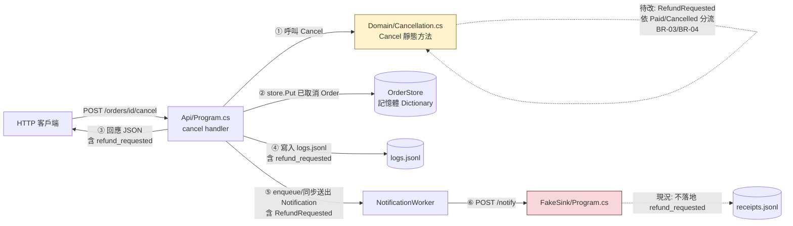
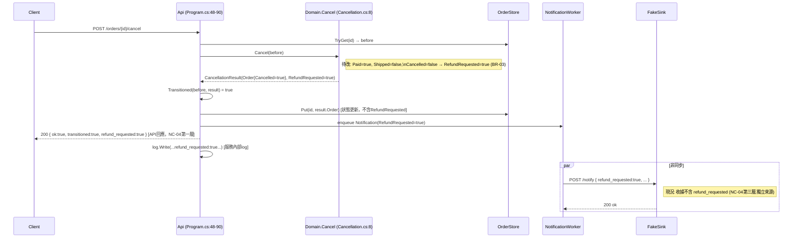
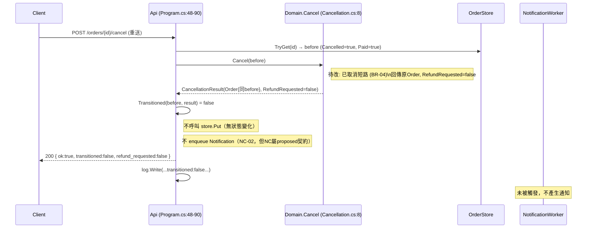

# Day10 設計包：Day9 範圍的審查用設計計畫

> 本文件為設計階段產出，不代表已實作、已測試或已核准。所有陳述均基於靜態讀碼（git 快照 `885e521`），未執行 `.NET` 測試，未驗證並行或重啟持久性行為。通知契約（`notification-contract-v2.1.md`）與 `decisions-v2.1.md` 中標記 `proposed` 的項目維持提案狀態，不在本輪 Domain 修改的接受範圍內。

---

## 1. 從 API 取消入口到 Domain 與結果使用端的追蹤

### 1.1 呼叫鏈（Call Graph）

| 步驟 | 呼叫方 | 被呼叫方 | 位置 |
|---|---|---|---|
| ① | HTTP `POST /orders/{id}/cancel` handler | `Cancellation.Cancel(before)` | `src/Api/Program.cs:69` → `src/Domain/Cancellation.cs:8` |
| ② | 同 handler | `Cancellation.Transitioned(before, result)` | `src/Api/Program.cs:70` → `src/Domain/Cancellation.cs:25` |
| ③ | 同 handler（transitioned 分支） | `store.Put(id, result.Order)` | `src/Api/Program.cs:73` → `src/Api/Program.cs:99`（`OrderStore.Put`） |
| ④ | 同 handler（transitioned 分支） | `channel.Writer.WriteAsync(n)` 或 `NotificationWorker.SendOnce(...)` | `src/Api/Program.cs:82-84` |
| ⑤ | `NotificationWorker.ExecuteAsync`（背景服務） | `_http.PostAsync(_sink, ...)` | `src/Api/Program.cs:232` |
| ⑥ | HTTP POST | `FakeSink` `/notify` handler | `src/FakeSink/Program.cs:14` |

### 1.2 資料流（Data Flow：`RefundRequested` 這個欄位怎麼被讀寫）

`CancellationResult.RefundRequested` 由 `Cancellation.Cancel` 產生（`src/Domain/Cancellation.cs:13` 已出貨分支固定 `false`；`src/Domain/Cancellation.cs:21` 未出貨分支目前也固定 `false`，尚未依 BR-03 依 `Paid` 分流），之後分岔進三條互不相同的下游，**不可混為一件事**：

1. **API 回應**：`result.RefundRequested` → JSON 欄位 `refund_requested`，回給呼叫端 `src/Api/Program.cs:89`。這是「API 接受並回報」，對應 `notification-contract-v2.1.md` NC-04 定義的第一層。
2. **狀態儲存**：`result.Order`（不含 `RefundRequested`，因為 `Order` record 本身沒有這個欄位）寫回 `OrderStore`，`src/Api/Program.cs:73`。之後 `GET /orders/{id}`（`src/Api/Program.cs:47`）讀到的是 `Order.Cancelled`，**讀不到 `RefundRequested`**——這個旗標目前不落地到可查詢的訂單狀態，只活在單次回應與 log／通知裡。這是 NC-04 第二層「狀態已改」的資料來源，但注意它不含退款資訊。
3. **通知**：`result.RefundRequested` 被塞進 `Notification` record（`src/Api/Program.cs:79` 建構子第 6 參數），經 channel 或同步路徑，最終在 `NotificationWorker.SendOnce`（`src/Api/Program.cs:200`）或 `ExecuteAsync`（`src/Api/Program.cs:231`）序列化為 JSON body 的 `refund_requested` 欄位，POST 給 `OC_SINK_URL`。
4. **Log**：`result.RefundRequested` 另外寫進 `logs.jsonl` 的 `refund_requested` 欄位，`src/Api/Program.cs:88`。這是服務端自己的紀錄，不是外部收據。

### 1.3 已知看得到 vs 尚未知道的消費端

- **看得到、已確認存在**：`FakeSink`（`src/FakeSink/Program.cs`）接收通知 POST body，但**只解析並落地 `notification_id`／`order_id`／`request_id`／`run_id`／`kind`／`received_at`**（`src/FakeSink/Program.cs:20-28`）——**`refund_requested` 完全沒有被讀取或寫進 `receipts.jsonl`**。也就是說，即便 Domain 改變 `RefundRequested` 的值，目前唯一的「送達」證據來源（接收端收據，NC-04 第三層）**看不到這個欄位的變化**，無法用收據驗證 BR-03。
- **看得到、未被程式讀取**：`tests/DomainTests/Program.cs:13`（`v1-3`）直接呼叫 `Cancellation.Cancel` 並斷言 `!r.RefundRequested`——這是唯一直接讀 Domain 回傳值的測試消費端，且與 BR-03 衝突，需要按 `scope-handoff.md` 所述反轉預期。
- **尚未知道**：`scope-handoff.md` 第 24 行已明確聲明「本包沒有 caller；完整 repo 影響範圍仍需補查，不得宣稱不存在依賴」。本次只讀到 `order-cancel-lifecycle@885e521` 這個快照內的三個進程（Api、FakeSink、DomainTests），**沒有材料可證明或否證是否還有其他服務、排程、對帳腳本讀取 API 回應或 `logs.jsonl` 中的 `refund_requested`**。此點列為未知，不代入「不存在」的結論。

---

## 2. 退款要求規則放 API 還是放 Domain 的取捨

| 面向 | 放在 API（`Program.cs:69` 附近） | 放在 Domain（`Cancellation.cs:8`） |
|---|---|---|
| 與 `scope-handoff.md` 邊界的相容性 | 違反「本輪不重寫 API」的明訂範圍（`packet-context.md:3`） | 符合「只設計 rules-v2.md 退款要求與重複取消」的範圍 |
| 三型別簽名限制 | 需要 API 層額外讀 `Order.Paid`／`Order.Shipped`／`Order.Cancelled` 才能重算，等於在 API 複製一份業務判斷，且 `Cancellation.Cancel` 仍回傳舊值，兩處真相不一致 | `Cancel` 本來就已經看得到 `order.Paid`、`order.Shipped`、`order.Cancelled`（呼叫時傳入的 `before`），規則所需資訊已具備，不需新增參數或改簽名 |
| 測試面 | 需要新增或改 API 整合測試才能驗證 BR-03/BR-04，`tests/DomainTests/Program.cs` 完全驗證不到 | 可直接在 `tests/DomainTests/Program.cs` 用既有的單元測試模式驗證，符合 `rules-v2.md` 列出的 SC-01～07（皆為 Given/When/Then 對 `Cancel` 呼叫的斷言） |
| 對已知消費端的影響 | API 回應欄位改變的邏輯分散在 Api 專案，Domain 的 `Cancel` 仍是「假」的（回傳恆 `false`），未來任何直接呼叫 Domain 的消費端（如另一個 API 或批次程式）會拿到錯誤結果 | 所有呼叫 `Cancellation.Cancel` 的消費端（目前已知只有 `src/Api/Program.cs:69` 與測試）同時得到正確結果，不會有兩套真相 |

**結論／最小方案**：規則改在 **Domain**（`src/Domain/Cancellation.cs:8` 的 `Cancel` 方法內部），符合現有簽名與呼叫關係，不需要碰 `src/Api/Program.cs`。這也與 `scope-handoff.md` 第 10-13 行「要改」清單一致。

**明確不做（Out of Scope）**：
- 不修改 `src/Api/Program.cs` 的任何一行（含 `refund_requested` 回應欄位的組裝方式——它已經是把 `result.RefundRequested` 原樣帶出，改了 Domain 後 API 端行為會自動跟著變，不需要另外改 API 程式碼）。
- 不修改 `Order`、`CancellationResult`、`Cancellation` 三型別的公開簽名（沿用 `rules-v2.md` 限制列）。
- 不新增 `Order` 上的 `RefundRequested` 持久欄位，也不讓 `OrderStore` 儲存它——`scope-handoff.md` 明訂「保持既有公開介面」，且通知契約仍是 proposed，不追加它的資料模型。
- 不處理 `FakeSink` 為何不落地 `refund_requested`——那是通知契約範圍，本輪不接受通知提案（`packet-context.md:3`）。

---

## 3. `RefundRequested` 欄位型別不變，是否有外部行為或資料意義改變？

型別確實不變（`bool`，`CancellationResult` record 簽名不動）。但**語意與外部可觀察行為會變**：

- **行為改變**：同一個 `Cancel(new Order(Shipped:false, Paid:true, Cancelled:false))` 呼叫，回傳的 `RefundRequested` 會從恆定 `false`（現況 `src/Domain/Cancellation.cs:21`）變成 `true`（BR-03）。這個值會透過第 1.2 節列的三條資料流出去：**API JSON 回應** (`src/Api/Program.cs:89`) 與 **logs.jsonl** (`src/Api/Program.cs:88`) 會立即反映新值；**通知 body** 的 `refund_requested` 欄位（`src/Api/Program.cs:200`／`231`）也會變成 `true`，但目前唯一的通知接收端 `FakeSink` 不解析這個欄位（第 1.3 節），所以「外部行為改變」在通知這一段是**傳了但無人讀**的狀態，不能宣稱通知消費端會因此有可觀察差異。
- **已知會看到差異的消費者**：呼叫 `POST /orders/{id}/cancel` 的任何 HTTP 客戶端（透過回應 JSON）、讀 `logs.jsonl` 的任何對帳／監控流程、`tests/DomainTests/Program.cs` 的 `v1-3` 測試（現行斷言會失敗，需反轉，`scope-handoff.md:12` 已預期）。
- **尚未知道會不會看到差異的消費者**：`scope-handoff.md:24` 已聲明完整 repo 影響範圍未補查。任何解析 `logs.jsonl` 的下游 ETL/對帳工具、任何直接引用 `OrderCancel.Domain.Cancellation.Cancel` 的其他呼叫端，本次沒有材料可確認是否存在——**不因為看不到就宣稱不存在**，需列為待查風險，交由後續補查或 Owner 確認。

---

## 4. `plan.md` 草稿

```markdown
# plan.md（草稿，設計階段，未實作未測試）

## 要改的檔案
1. src/Domain/Cancellation.cs
   - Cancel 方法（第 8-22 行區塊）：
     a. 已取消（order.Cancelled == true）分支：新增顯式短路，回傳原 order、RefundRequested=false，
        不丟例外（對齊 BR-04 / SC-06 / SC-07）。
     b. 未出貨且未取消分支：RefundRequested 依 order.Paid 決定
        （Paid=true → true；Paid=false → false），對齊 BR-03 / SC-01 / SC-03 / SC-04。
     c. 已出貨分支（第 11-14 行）維持不變：RefundRequested 恆 false（BR-02 / SC-02 / SC-05）。
   - 不改方法簽名、不改 Order / CancellationResult record。

2. tests/DomainTests/Program.cs
   - 反轉 v1-3（第 13 行）的預期：Paid=true, Shipped=false, Cancelled=false → RefundRequested 應為 true。
     （scope-handoff.md 已預期此反轉，非把舊規格追認成 bug。）
   - 新增 SC-01, SC-02, SC-04, SC-05, SC-06, SC-07 對應測試（SC-03 即反轉後的 v1-3，可保留或重命名）。
   - 每個 SC 覆蓋完整 Then（Cancelled 與 RefundRequested 都要斷言，不可只查部分欄位）。

## 順序
1. 先改 Cancellation.Cancel（唯一產生規則結果的地方）。
2. 對照 rules-v2.md 的 SC 表逐條補測試，含既有 v1-1、v1-2 不可回歸。
3. 不動 src/Api/Program.cs、src/FakeSink/Program.cs（範圍外，見第2節）。

## 單元情境（對應 rules-v2.md SC-01～07）
| SC | Given (Shipped,Paid,Cancelled) | Then |
|---|---|---|
| SC-01 | false,false,false | Cancelled=true, RefundRequested=false |
| SC-02 | true,-,false | 回傳同一 Order 值，不丟例外 |
| SC-03 | false,true,false | Cancelled=true, RefundRequested=true |
| SC-04 | false,false,false | RefundRequested=false（與 SC-01 同場景不同斷言重點） |
| SC-05 | true,true,- | 回傳原訂單, RefundRequested=false |
| SC-06 | false,false,true | 回傳原訂單, RefundRequested=false, 不丟例外 |
| SC-07 | false,true,true | 回傳原訂單, RefundRequested=false（不重複退款） |

## 整合情境（範圍外，僅記錄以供後續判斷，本輪不實作）
- API 層對已取消訂單重複呼叫 /cancel 時，回應 JSON 的 refund_requested 是否忠實反映 Domain 的 false
  ——理論上會自動正確（因為 API 只是原樣帶出 result.RefundRequested），但本輪不執行測試驗證，
  需留待 API/整合測試回合確認。

## 每個結果以誰為準
- Cancelled 值：以 tests/DomainTests/Program.cs 中對 CancellationResult.Order.Cancelled 的斷言為準。
- RefundRequested 值：以同一測試檔對 CancellationResult.RefundRequested 的斷言為準。
- API 回應中的 refund_requested、通知 body 中的 refund_requested：不在本輪驗收範圍，
  以 Domain 單元測試結果外推，不代表已對 API/通知路徑做過驗證。

## 待人接受的風險
1. FakeSink 目前不解析/不落地 refund_requested（src/FakeSink/Program.cs:20-28），
   BR-03 改動後這個欄位改變無法透過現有收據機制驗證，需 Owner 決定是否接受此落差
   或另案處理（通知契約範圍，本輪不做）。
2. src/Api/Program.cs 的 cancel handler 在 TryGet(before) 與 store.Put(result.Order) 之間
   （src/Api/Program.cs:63-73）沒有鎖或 CAS，對同一 order id 併發呼叫可能發生競態，
   使 Transitioned 判斷或 RefundRequested 首次觸發不保證恰好一次。
   這是既有限制，本輪不新增修復，僅記錄風險供後續回合評估。
3. OrderStore 為程序內記憶體字典（src/Api/Program.cs:98），不保證重啟持久性；
   RefundRequested 本身也不落地到 Order/OrderStore，只存在單次回應與 log 中。
   本輪不驗證、不承諾持久化行為。
4. repo 內是否還有其他呼叫 Cancellation.Cancel 的消費端，本次未能窮盡確認
   （scope-handoff.md 第24行已聲明），列為待補查風險而非已排除風險。
```

---

## 5. Mermaid 圖

### 5.1 元件圖（現況，標示待改處）



### 5.2 首次取消循序圖（未出貨、已付款、未取消 → transitioned）



### 5.3 重複取消循序圖（已取消、已付款 → 冪等）



---

## 摘要

Domain 改動集中在 `src/Domain/Cancellation.cs:8-22`，不動 API/FakeSink，符合 `scope-handoff.md` 邊界；主要已知風險是 `FakeSink` 收據不含 `refund_requested`、API 層 TryGet/Put 之間無鎖可能競態、以及 repo 內是否還有其他 `Cancel` 呼叫端尚未窮盡確認——均留待 Owner 或後續回合處理，本輪不新增修復或恰好一次保證。`plan.md` 草稿與圖表僅為設計，尚未實作、未執行測試。