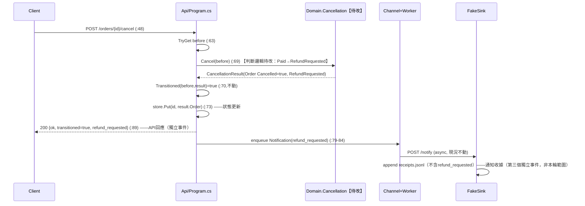
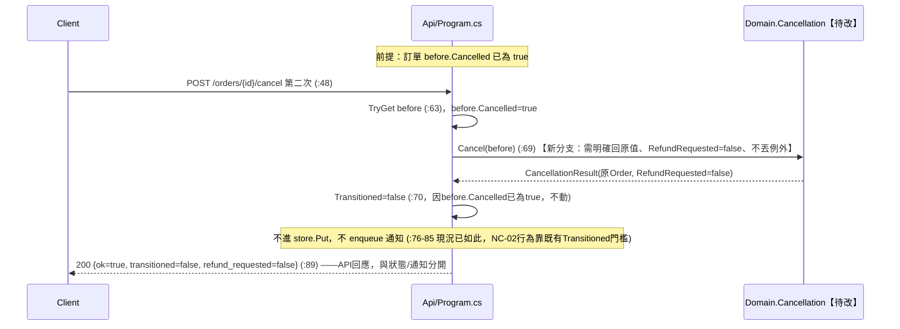

# ORD-142 Day10 設計審查稿：BR-03／BR-04（rules-v2.md）

範圍聲明：本稿只涵蓋 `rules-v2.md` 的 BR-03（退款要求反轉）與 BR-04（重複取消）。通知契約（`notification-contract-v2.1.md`）與其決策（`decisions-v2.1.md`）狀態仍是 `proposed`，本稿只在追呼叫鏈與談取捨時引用，不在本輪落地。未執行 `dotnet test`／`dotnet run`，以下引用只支持靜態推論。

---

## 1. 呼叫鏈與資料流：從 API 取消入口到 Domain 與結果使用端

**呼叫鏈（call chain）**

1. `src/Api/Program.cs:48` `app.MapPost("/orders/{id}/cancel", ...)` — HTTP 入口。
2. `src/Api/Program.cs:63` `store.TryGet(id, out var before)` — 讀既有 `Order`（`OrderStore`，`src/Api/Program.cs:96-101`）。
3. `src/Api/Program.cs:69` `var result = Cancellation.Cancel(before);` — 呼叫 Domain，本輪要改的方法本體在 `src/Domain/Cancellation.cs:8-22`。
4. `src/Api/Program.cs:70` `bool transitioned = Cancellation.Transitioned(before, result);` — 呼叫 `src/Domain/Cancellation.cs:25`；這是「唯一成功轉換」的判準，本輪不改。
5. `src/Api/Program.cs:73` `store.Put(id, result.Order);` — 只在 `transitioned` 為真時把 Domain 結果寫回 store。
6. `tests/DomainTests/Program.cs:11-13` 三個 `Check(...)` 直接呼叫 `Cancellation.Cancel(...)` 並讀 `.Order.Cancelled` / `.RefundRequested`，是目前唯一對 `Cancellation.Cancel` 的測試端消費者。

**資料流（data flow，`result.RefundRequested` 的去向，與呼叫鏈分開列）**

- `src/Api/Program.cs:79` 建 `Notification` record 時把 `result.RefundRequested` 存入欄位（`Notification` 定義於 `src/Api/Program.cs:94`）。
- `src/Api/Program.cs:88` 寫入 `logs.jsonl` 的欄位 `refund_requested = result.RefundRequested`（透過 `JsonlLog.Write`，`src/Api/Program.cs:137-147`）。
- `src/Api/Program.cs:89` HTTP 回應 JSON 的 `refund_requested` 欄位，直接回給呼叫端。
- `src/Api/Program.cs:200`（`NotificationWorker.SendOnce`，同步演練路徑）與 `src/Api/Program.cs:231`（`NotificationWorker.ExecuteAsync`，一般 worker 路徑）都把 `n.RefundRequested` 序列化進 POST body，送到 `OC_SINK_URL`。
- `src/FakeSink/Program.cs:14-35` 接收該 POST，但寫入 `receipts.jsonl` 的 `receipt` 物件（`src/FakeSink/Program.cs:20-28`）**沒有** `refund_requested` 欄位 — 這條資料流在 FakeSink 這一站被截斷，不進收據。

一句話總結：`RefundRequested` 這個值有三個目前看得到的出口（API 回應、logs.jsonl、對 sink 的 POST body），但只有前兩者有持久化紀錄；送到 FakeSink 的那份會被丟棄，不出現在 `receipts.jsonl`。

---

## 2. 規則放 API 還是放 Domain 的取捨

**現況錨點**：`Cancellation.Cancel` 已經是唯一產生 `CancellationResult` 的地方（`src/Domain/Cancellation.cs:8`），API 端（`src/Api/Program.cs:69,79,88,89`）全部是「原樣轉發 `result.RefundRequested`」，沒有自己算過這個值。

**選項 A：規則放 Domain（改 `Cancellation.Cancel` 內部）**
- 優點：`Order`／`CancellationResult`／`Cancellation` 三型別簽名不變（符合 `rules-v2.md` 的限制列），API 完全不用動，`src/Api/Program.cs:69-89` 的轉發邏輯自動吃到新結果。
- `DomainTests`（`tests/DomainTests/Program.cs`）可以直接對著 Domain 驗規則，不需要起 HTTP 服務。
- 風險：目前 `Cancel` 對「已取消再取消」（BR-04）的分支還沒有獨立判斷（見下方分析），需要新增一個 `order.Cancelled` 的檢查點。

**選項 B：規則放 API（在 `src/Api/Program.cs:69` 之後、回應組裝之前另外算一次 `RefundRequested`）**
- 需要 API 重新讀一次 `before.Paid / before.Shipped / before.Cancelled` 來覆寫或旁路 `result.RefundRequested`，等於在 API 和 Domain 各存一份判斷邏輯。
- 會製造兩個事實來源：`DomainTests` 測的是 Domain 版本，實際 API 回應／通知走的是 API 版本，兩者一旦不同步，`tests/DomainTests/Program.cs` 的綠燈不能代表 API 行為正確。
- 且 `packet-context.md` 明講本輪「不重寫 API」，選項 B 需要動 `src/Api/Program.cs`，超出本輪授權範圍。

**結論（最小方案）**：只改 `src/Domain/Cancellation.cs:8-22` 的 `Cancel` 方法本體，讓它依 `order.Paid && !order.Shipped && !order.Cancelled` 決定 `RefundRequested`，並讓已取消（`order.Cancelled == true`）分支明確回傳原值、`RefundRequested=false`、不丟例外。API 與 FakeSink 不動。

**明確不做（out of scope）**
- 不改 `src/Api/Program.cs` 任何一行（回應格式、通知 enqueue 條件、`Transitioned` 判斷都不動）。
- 不補 FakeSink 讓 `receipts.jsonl` 記錄 `refund_requested`（屬於 `notification-contract-v2.1.md` 提案範圍，且該契約仍是 `proposed`）。
- 不處理 `decisions-v2.1.md` 裡 NC-02 與其他決議的矛盾（重複取消是 200 冪等還是 409，不影響 Domain 層 BR-04 的判斷本身）。
- 不新增併發鎖、不新增持久化、不承諾 exactly-once。

---

## 3. `RefundRequested` 型別不變，但行為／資料意義是否改變？

**型別層面**：`CancellationResult(Order Order, bool RefundRequested)`（`src/Domain/Cancellation.cs:4`）不變，`bool` 簽名不變，符合 `rules-v2.md` 限制列的硬性要求。

**行為／意義層面改變**：目前 `Cancel` 對所有未出貨的訂單一律回 `RefundRequested: false`（`src/Domain/Cancellation.cs:13,21`），與 `Paid` 無關。BR-03 要求已付款、未出貨、未取消時要變成 `true`。這代表同一個布林欄位，從「恆為 false 的佔位符」變成「真正反映付款狀態的旗標」——語意變了，即使型別沒變。

**看得到的消費者（會受影響）**
- `tests/DomainTests/Program.cs:13`（v1-3）：目前斷言 `!r.RefundRequested`，用的 Given 正是「已付款、未出貨、未取消」，BR-03 落地後這行會反過來失敗，`scope-handoff.md` 也已預告要更新此預期。
- `src/Api/Program.cs:89` 的 HTTP 回應欄位 `refund_requested`：任何呼叫 `/orders/{id}/cancel` 的客戶端，若付款訂單被取消，會從一律收到 `false` 變成可能收到 `true`。
- `src/Api/Program.cs:88` 的 `logs.jsonl` 欄位 `refund_requested`：任何讀這份 log 做對帳或告警的人也會看到值變化。

**尚未知道的消費者（不能斷言不存在）**
- 本包只包含 `src/Api/Program.cs`、`src/FakeSink/Program.cs`、`tests/DomainTests/Program.cs` 四個檔案（見 `manifest.json`）。`scope-handoff.md` 第 24 行已明確提醒「本包沒有 caller；完整 repo 影響範圍仍需補查，不得宣稱不存在依賴」——雖然本輪 packet 比 Day9 多帶了 API／FakeSink，但這仍是同一份 git 快照的部分檔案，不代表已窮舉整個 repo 對 `Cancellation.Cancel` 或 `refund_requested` 欄位的所有引用。
- `src/FakeSink/Program.cs:20-28` 雖然收到 POST body 裡的 `refund_requested`，但沒有寫進 `receipts.jsonl`；是否有其他中介（例如尚未在本包出現的告警／對帳工具）直接檢視 POST 原始 body 而非收據檔，未知，不能假設沒有。
- `notification-contract-v2.1.md` 描述的正式通知消費者（NC-01～07）目前狀態是 `proposed`，尚未有實作，因此還談不上「消費者」，但一旦被接受，`refund_requested` 的語意改變會直接影響其內容，值得在通知本記錄一句提醒。

---

## 4. `plan.md` 草稿（設計，非已驗證結果）

```md
# plan.md（草稿，設計階段，未執行測試）

## 要改的檔案
1. src/Domain/Cancellation.cs
   - Cancel(order): 依 order.Cancelled 先分流：
     - Shipped==true → 現有分支不變（原訂單、RefundRequested=false、不丟例外）
     - Cancelled==true（且未出貨）→ 新分支：原訂單值、RefundRequested=false、不丟例外（BR-04）
     - 其餘（未出貨、未取消）→ Cancelled=true、RefundRequested = order.Paid（BR-03/BR-01/BR-04的否定情形）
   - Order/CancellationResult/Cancellation 三型別簽名不動。
2. tests/DomainTests/Program.cs
   - 更新 v1-3 預期：已付款、未出貨、未取消時 RefundRequested 應為 true（配合 BR-03）。
   - 新增 SC-03～SC-07 對應的 Check(...)：已付款取消(SC-03)、未付款取消(SC-04)、已出貨已付款(SC-05)、
     已取消未付款再取消(SC-06)、已取消已付款再取消(SC-07)。
   - SC-01/SC-02 若既有測試只驗部分欄位，依 rules-v2.md 完整 Then 補齊 RefundRequested 斷言。

## 不動的檔案（本輪明確排除）
- src/Api/Program.cs：完全靠透傳 result.RefundRequested，不需要改。
- src/FakeSink/Program.cs：不補 refund_requested 欄位到 receipts.jsonl（屬通知契約提案範圍）。

## 建議順序
1. 先改 tests/DomainTests/Program.cs，把 SC-01～SC-07 寫成明確的失敗中斷言（鎖住規格）。
2. 再改 src/Domain/Cancellation.cs 的 Cancel 邏輯。
3. 本輪不執行 dotnet test/run；由下一輪或作者本地驗證。
4. （可選、非本輪必要）人工核對 API 回應/logs.jsonl 在真的付款+取消情境下是否如預期透傳 true——
   因為 API 端沒有程式碼變更，這一步是驗證假設，不是新增邏輯。

## 需要的情境（單元／整合）
單元（tests/DomainTests/Program.cs，對 Cancellation.Cancel 直接呼叫）：
- SC-01 未出貨/未付款/未取消 → Cancelled=true, RefundRequested=false
- SC-02 已出貨/未取消 → 原訂單值、不丟例外
- SC-03 已付款/未出貨/未取消 → Cancelled=true, RefundRequested=true
- SC-04 未付款/未出貨/未取消 → RefundRequested=false
- SC-05 已出貨/已付款 → 原訂單、RefundRequested=false
- SC-06 未出貨/已取消/未付款 → 原訂單值、RefundRequested=false、不丟例外
- SC-07 未出貨/已取消/已付款 → 原訂單值、RefundRequested=false（不重複退款）

整合（超出本輪範圍，僅記錄待辦）：
- 透過 /orders + /orders/{id}/cancel 手動打兩次 API，確認回應欄位與 logs.jsonl 透傳值符合 Domain 新行為。
- 不涉及 FakeSink 收據內容驗證（該欄位目前不進 receipts.jsonl，屬另一輪待決）。

## 每個結果以誰為準
- Domain 狀態轉換是否正確（Cancelled/RefundRequested 值）：以 tests/DomainTests/Program.cs 的 SC-01～07 為準。
- API 對外回應（HTTP JSON 的 refund_requested）：以 src/Api/Program.cs:89 的透傳邏輯為準，
  本輪不另建 API 測試，正確性依賴「Domain 正確 + 透傳不變」兩個前提，未獨立驗證。
- 通知是否送達：以 receipts.jsonl（FakeSink，src/FakeSink/Program.cs:32）為準，
  但該檔案不含 refund_requested，本輪改動對它沒有可觀測影響。

## 待人（Owner）接受的風險
- v1-3 測試預期反轉：若有未列於本包的既有呼叫端假設 RefundRequested 恆為 false，會受影響，
  本輪無法窮舉確認是否存在此類呼叫端。
- FakeSink 收據不含 refund_requested：這次規則反轉後，此落差變得更值得處理，
  但補它屬於 notification-contract-v2.1.md（仍 proposed）的範圍，本輪不做，只記錄提醒。
- decisions-v2.1.md 的 NC-02 與 notification 契約文字本身有矛盾（200 冪等 vs 409），
  與本輪 BR-03/04 無耦合，但共用同一支 /cancel 端點，未來合併變更時要分開審查、分開 PR。
- src/Api/Program.cs:63,69,73（TryGet → Cancel → Put）為既有的非原子三步驟，
  同時併發取消同一張訂單存在競態；本輪不修，僅列為既有限制。
- OrderStore 為記憶體字典（src/Api/Program.cs:96-101），無重啟持久性；本輪不修，僅列為既有限制。
```

---

## 5. Mermaid 圖

### 元件圖（現況 vs 待改）

```mermaid
flowchart LR
    subgraph Client
        C[HTTP Client]
    end
    subgraph API[src/Api/Program.cs 現況不動]
        EP["POST /orders/{id}/cancel<br/>Program.cs:48"]
        Store["OrderStore<br/>Program.cs:96-101"]
        Chan["Channel&lt;Notification&gt;<br/>Program.cs:18,84"]
        Worker["NotificationWorker<br/>Program.cs:184-253"]
    end
    subgraph Domain["src/Domain/Cancellation.cs 本輪待改"]
        Cancel["Cancellation.Cancel<br/>:8-22 【改】BR-03/BR-04邏輯"]
        Trans["Cancellation.Transitioned<br/>:25 不動"]
    end
    subgraph Sink[src/FakeSink/Program.cs 現況不動]
        Notify["POST /notify<br/>:14-35"]
        Receipts["receipts.jsonl<br/>不含refund_requested"]
    end
    subgraph Tests[tests/DomainTests/Program.cs 本輪待改]
        DT["Check(...) :11-13<br/>【改】v1-3預期、加SC-03~07"]
    end

    C -->|HTTP| EP
    EP -->|TryGet :63| Store
    EP -->|Cancel(before) :69| Cancel
    EP -->|Transitioned :70| Trans
    EP -->|Put(result.Order) :73| Store
    EP -->|enqueue Notification :79-84| Chan
    Chan --> Worker
    Worker -->|POST body含refund_requested :231| Notify
    Notify -->|receipt不含refund_requested :20-28| Receipts
    EP -->|HTTP 200 JSON refund_requested :89| C
    DT -->|直接呼叫| Cancel
```

### 循序圖 1：首次取消（transition，BR-01/03）



### 循序圖 2：重複取消（BR-04，非 transition）



---

**摘要**：本輪最小可行方案是只改 `src/Domain/Cancellation.cs` 的 `Cancel` 方法與 `tests/DomainTests/Program.cs` 的測試預期，API／FakeSink 不動；`RefundRequested` 型別不變但語意從恆假變成反映付款狀態，已知消費者是 API 回應與 `logs.jsonl`，`receipts.jsonl` 目前不受影響（因其本就不記錄該欄位）；既有 store 的非原子操作與無持久性限制均未在本輪處理，僅列為待接受風險。本稿未執行任何測試，一切結論為靜態設計推論，需人工核准後才能進入實作。