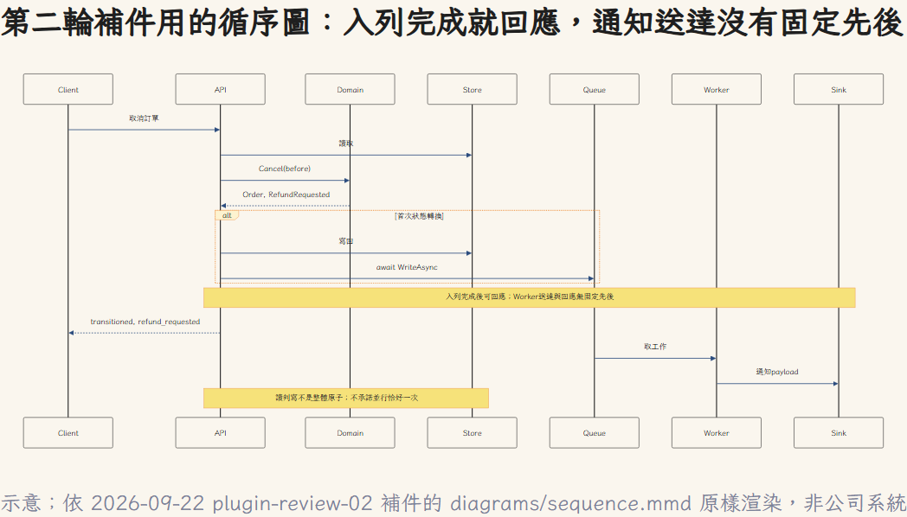

# Day 13 補充：換工具之後，引用真的更可靠嗎？

這是 Day 8 教學示範 repo 的另一組實驗，不是訂單 PR 的第二輪審查。原始紀錄保留，以下整理既有文章的觀察；未新增實跑。

## 八次實跑：結論一致，引用仍須核對

上面那次誤判是單一個案。它容易被讀成「再找個別的工具來查就好」，所以我把這件事做成可重跑的實驗。

用的是 Day 8 那個教學示範 repo（七個 C# 檔，逐檔雜湊相同）、同一份提示，只換「眼睛」：

| 組 | 眼睛 | 次數 |
|---|---|---|
| A 基線 | Read、Grep、Glob | 3（沿用 Day 8 的紀錄，不重跑） |
| B 索引 | 只有 codegraph 的八個 MCP 工具，**沒有 Read** | 3 |
| C 混合 | codegraph 八個＋Read | 2 |

**五個問題的結論，八次完全一致。** 報表走哪個方法、SQL 少了什麼條件、修計薪會不會連帶修好報表，換成程式碼索引，答案沒有變。

變的是**引用能不能核對**，而且錯法有兩種：

**第一種，漏。** B1 與 C1 只叫了一次 `codegraph_explore`，它回傳四個檔案的原始碼；另外三個呼叫端不在裡面，模型就不知道它們存在，「還有誰呼叫」答成只有一個。**八筆引用全部可核對，答案卻是不完整的。** A 組三次都找齊四個，因為 Grep 是全文找字。

**第二種更麻煩：找齊了，但行號是錯的那種對。** B2、B3、C2 加叫了 `codegraph_callers`，四個呼叫端都找到了。但 `callers` 回傳的是**呼叫者方法的宣告位置**，`BonusCalculator.cs:11` 是那個方法的簽名行，真正的呼叫在第 13 行。模型照抄工具給的行號。

然後是今天的重點：**Day 8 的核對程式放行了這些引用。**

檔案存在、行號在範圍內、trace 裡有這個位置，三項全過。因為核對程式信的是「工具回傳裡出現過」，而這正是索引對「位置」的定義。**核對者與被核對者共用同一份依據，所以一起錯。**

加一道很笨的檢查才抓得出來：引用的那一行裡，到底有沒有 `ListEffectiveInPeriod(` 這串字？

| 組 | 引用行內真的含呼叫 |
|---|---|
| A（Read／Grep） | **12／12** |
| B2、B3、C2（索引） | **0／12** |

所以「再找一個工具來審」不會讓判斷變獨立。**獨立不是換一個工具，是換一份依據**，Read 讀到的原文，才是跟索引獨立的來源。

這組結果提醒我們，換工具不能保證證據獨立。Owner 接受則是另一件事：它涉及決策權與責任，不能由這組引用實驗推導。

*界線：七個檔、167 行，不是大 repo，索引的省 token 主張在這個規模測不出來，也不能說它不成立；B 三次、C 兩次，不是統計。codegraph 回傳宣告行是它的設計選擇，不是 bug，問題出在引用者（模型）與核對者（程式）都沒分清宣告與呼叫。*

## 補件循序圖原件

以下為 Day 13 第二輪審查所讀取之 Mermaid 補件的原樣渲染，與上面的索引工具實驗是不同案例。正文使用重新繪製的重點示意；此處保留完整參與者與訊息關係。

首次狀態轉換才進行寫回與入列；此圖不承諾並行恰好一次，也不代表已取得 Owner 接受。
